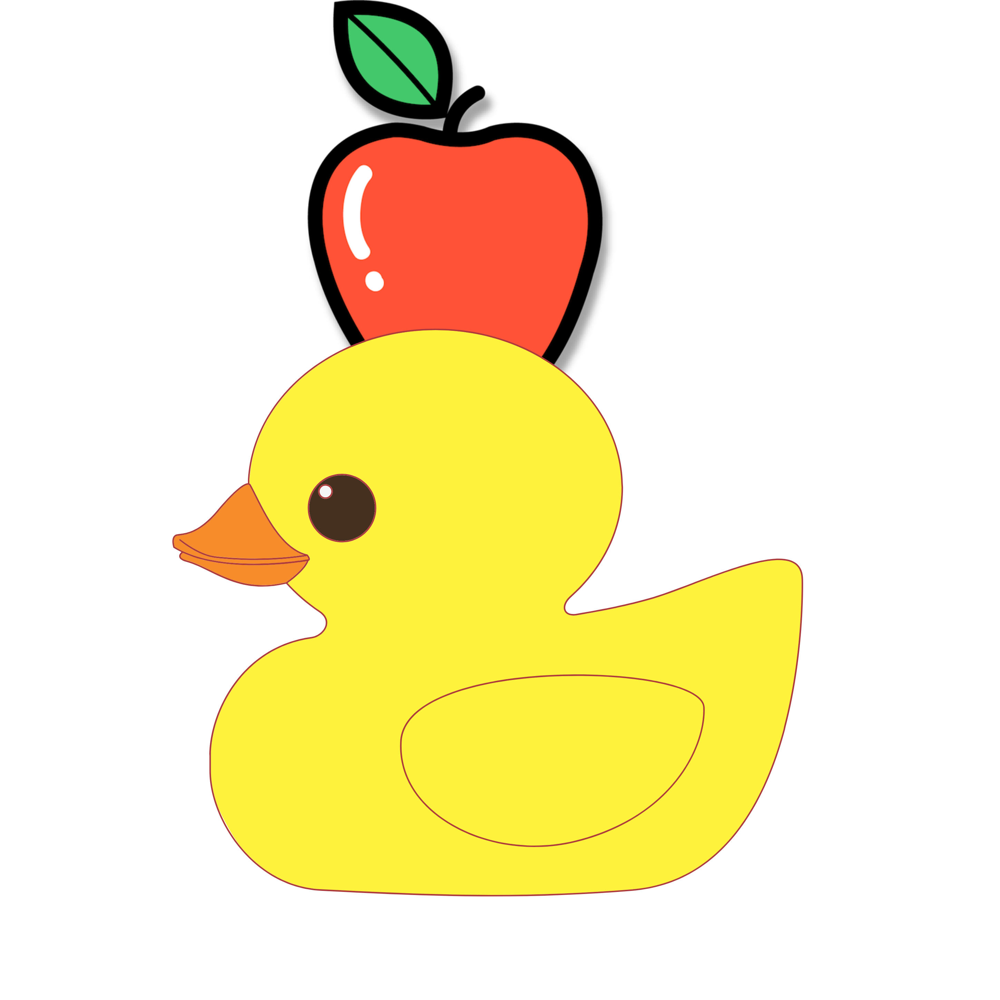

# Mite Hub [](https://discord.gg/BuCZqwc2Ux)
Free Roblox Script Hub designed for Roblox Games.  
***Mite Hub is still in beta stage of development so expect some bugs or lack of features.***  
Made By ***mite#6873***  
### Main Loadstring
```lua
loadstring(game:HttpGet(("https://raw.githubusercontent.com/Miteduckings/Mite-Hub/main/Loader/Loader.lua"), true))()
```
### Key Loadstring
```lua
loadstring(game:HttpGet(("https://raw.githubusercontent.com/Miteduckings/Mite-Hub/main/Loader/KeyLoader.lua"), true))()
```
### Keyless Loadstring
```lua
loadstring(game:HttpGet(("https://raw.githubusercontent.com/Miteduckings/Mite-Hub/main/Loader/KeylessLoader.lua"), true))()
```
### Supported Games
- [Arsenal](https://www.roblox.com/games/286090429/)
- [Natural Disaster Survival](https://www.roblox.com/games/189707/)
- [Ohio.](https://www.roblox.com/games/7239319209/)

### Coming Soon.
- [Evade](https://www.roblox.com/games/9872472334/)
- [Fishing Simulator](https://www.roblox.com/games/2866967438/)
